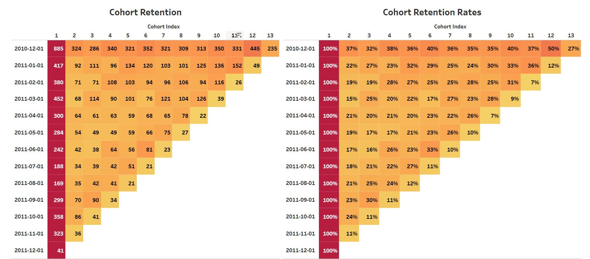

## Project 8: Cohort Retention Analysis using SQL and Tableau

## Author
Shokhina Badrieva (shokhina.badrieva@gmail.com)

 

## Business Problem and Motivation
Cohort retention analysis is useful because it allows companies to measure the long-term value of their customers, as well as identify areas where retention strategies can be improved. By tracking how different groups of customers behave over time, companies can gain insights into their customer base and tailor their marketing and retention efforts accordingly.

In our project, we will conduct a cohort retention analysis for an online sales company to determine the retention rate of customers acquired within specific time periods. This analysis will enable us to identify any trends or patterns in customer behavior over time and help us develop effective retention strategies to increase customer loyalty and revenue.

## Data Source
The data source is an in an excel file in this repository in the file titled "Online Retail". [Link to dataset](https://archive.ics.uci.edu/ml/datasets/Online+Retail)

## Methods/Skills Used
The project utilizes the following skills:

* SQL Join
* Temp Tables 
* Subqueries
* T-SQL pivot
* Tableau visualization

## Quick Glance at Results

## Tableau Public Link
[Link to visualization](https://public.tableau.com/app/profile/shokhina.badrieva/viz/Cohort_Retention_Analysis/Dashboard1)

## Credit
Done with the guidance of [Angelina Frimpong](https://www.youtube.com/watch?v=LXqpx9mr0Is).
