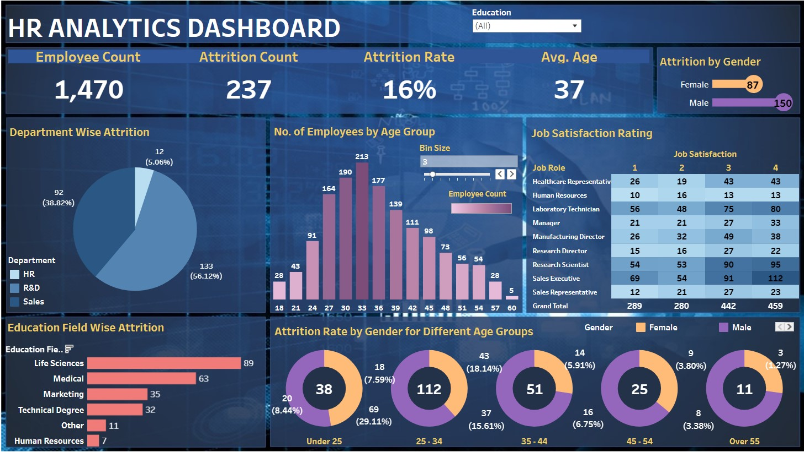

# Project 4: HR Analysis of Attrition within a company and use of Tableau for data visualization.

## Author
Shokhina Badrieva
(shokhina.badrieva@gmail.com)

 

## Business Problem and Motivation
The goal of this project is to provide insights to the attrition within a company. Which groups of people are leaving the company at higher rates, and can we figure out why these specific groups are leaving?

 

## Data Source
The data source is an in an excel file and is titled HR Data.xlsx in this repository. [Link to dataset](https://github.com/sbadrieva/PortfolioProjects/blob/main/%5BExcel%2C%20Tableau%5D%20HR_Analysis_Dashboard/HR%20Data.xlsx)

 

## Methods/Skills Used
The project utilizes the following skills:
* Tableau custom charts
* Aggregation
* KPI Analysis
* Custom background design

 

## Tableau Results
The interactive tableau dashboard can be viewed [here.](https://public.tableau.com/app/profile/shokhina.badrieva/viz/HR_Dashboard_16791903684200/HRDashboard)

 

## Quick Glance at Results

## Credit
Done with the guidance of [Data Tutorials](https://www.youtube.com/watch?v=oTyCZVnNVZA). 
