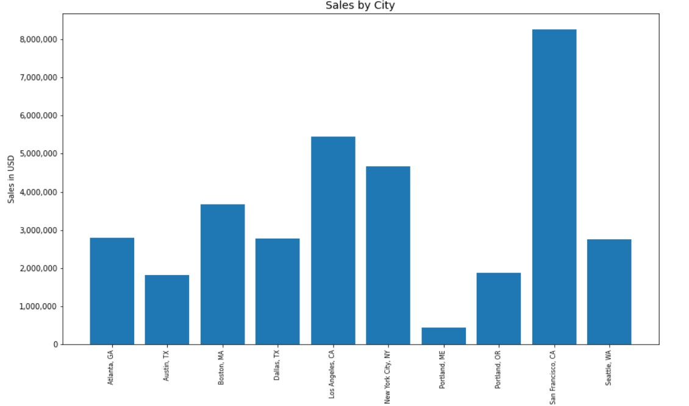

## Project 7: Marketing Analysis on Sales Data Using Python 

## Author
Shokhina Badrieva (shokhina.badrieva@gmail.com)

 

## Business Problem and Motivation
The marketing landscape has become increasingly complex, with companies facing stiff competition and limited resources to allocate towards marketing efforts. As a result, businesses must have a thorough understanding of their sales data to make informed decisions on their marketing strategies.

In this project, I conducted a comprehensive analysis of a company's sales data using Python. The aim of the project was to identify key insights and patterns in the data that could inform the company's marketing strategy.

To accomplish this, I utilized various data manipulation and visualization techniques to explore the data and identify trends. By analyzing the data, I was able to determine the best time to market certain products and identify which products are commonly sold together. These insights can be used to optimize the company's marketing efforts and drive revenue growth.

## Data Source
The data source is an in an excel file in this repository in the folder titled "Sales_Data". Credit to Keigth Galli. [Link to dataset](https://github.com/KeithGalli/Pandas-Data-Science-Tasks)

## Methods/Skills Used
The project utilizes the following skills:

*Python pandas
*Python matplotlib
*Joins
*Custom functions

## Quick Glance at Results
First, we grouped our data using different criteria to see total ales based on grouping. Our analysis revealed that the city of San Francisco had the highest total sales compared to other cities, while the month of December had the highest sales across all cities.
 

 

 
 

To further analyze sales trends, we grouped sales data by hour to determine which hours of the day received the most orders. The purpose of this analysis is to identify the optimal times to market products and increase sales during peak hours. These insights can inform marketing strategies and help drive revenue growth by targeting specific hours of the day with promotional offers and advertising.
 

 
 

To gain a better understanding of sales trends per hour by city, we further analyzed the sales data by breaking it up by city and hour. This allowed us to identify specific hours of the day in each city with the highest sales, providing insights that can inform city-specific marketing strategies to optimize revenue growth.
 

 
 

To identify which products were most commonly sold together, we first needed to understand the distribution of the number of distinct products sold per order. To do this, we calculated a histogram to visualize the distribution of the number of distinct products per order.
 

 
  

Through the histogram analysis, we observed that the majority of orders contained only one distinct product, while a small percentage of orders contained multiple distinct products. To identify which products were most commonly bought together for these orders, we analyzed the unique combinations of two products sold together and identified the top ten combinations. These insights can inform cross-selling and product bundling strategies to optimize revenue growth.
 

 
 

In our final analysis, we sought to identify the most sold products and explore the factors driving their popularity. One hypothesis we had was that cheaper products might be selling more than higher-priced products. To test this hypothesis, we created a dual axis chart that compared the total amount sold per product against the product price. Our initial results showed some correlation between price and sales, but further analysis is required to fully understand the factors driving customer purchasing behavior. These insights can help inform pricing strategies and optimize revenue growth.
 

 
 

In conclusion, this project provided a comprehensive analysis of sales data that revealed insights into customer purchasing behavior, the optimal time to market products, city-specific sales trends, and popular product combinations. These findings can be used to inform marketing strategies and drive revenue growth for businesses.

