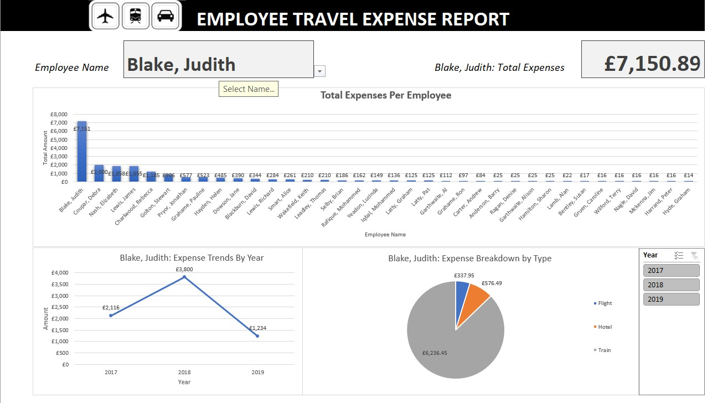

# Excel Project 2: Travel Expense Report

## Author
Shokhina Badrieva
(shokhina.badrieva@gmail.com)

## Table of Contents
{:toc}

## Business Problem and Motivation
For this project, I wanted to create an Interactive Employee Expense Report that dynamically updates all values based on the Employee Name. This report can be used to find key information about how much an employee has spent on travel expenses, the breakdown by year, the breakdown by type of expense, and how they compare to all other employees with easy to understand visualizations. The beauty of this report is that everything will update dynamically as new data is added into the Clean Data worksheet. Nothing needs to be done by the viewer except update the cleaned data.

## Data Source
The data source is an employee expense csv file from data.world. Data from 2017-18 and 2018-19 is combined to create a combined dataset. [Link to dataset](https://data.world/datagov-uk/9666e74f-016d-4ecf-990a-b215637479b5)

## Methods/Skills Used
The project utilizes the following skills:
* Data Cleaning (Flash Fill, Combining Datasets, Number Formats)
* Data Validation 
* VBA Macros
* Conditional Formatting
* Linking Pivot Tables
* Complex Functions
* Pivot Tables and Charts

## Quick Glance at Results 

## Business Insights and Use
A business can quickly see which employees have spent the most on travel expenses and can then click on each individual employee to see further information in the graphs. Businesses can click on an employee name and see the total expenses, trends of expenses by year, and most common type of expenses. This is all done dynamically.
## What can be improved/ added
Improvements:
* One thing that can make the report more visually interactive is when an employee name is picked from the drop down list, the bar that corresponds to that name is highlighted red. This will make it pop right away. 
* Another improvement is finding a way to automaticaly get raw data into cleaned data sheet, so that when new raw data is added, the cleaned data gets automatically updated. As of now, the cleaning of the data is done manually.
* A filtered report of details of employee expenses can be added to report. The filter function in Excel 2021 an do this easily, but unfortunately I only have Excel 2019 at this time. 
