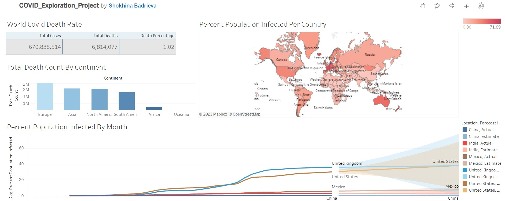

# Excel Project 4: Covid Dataset Exploration using complex SQL queries

## Author
Shokhina Badrieva
(shokhina.badrieva@gmail.com)

 

## Business Problem and Motivation
The goal of this project is to explore the COVID Dataset using complex SQL queries. I want to find out the rate of death and rate of vaccination per country and continent. I want to visualize the results in an easy to understand and compelling tableau dashboard.
 

## Data Source
The data source is from Our World in Data. [Link to dataset](https://ourworldindata.org/covid-deaths)

 

## Methods/Skills Used
The project utilizes the following skills:
* SQL
* Joins
* CTEs
* Temp Tables
* Windows Functions
* Aggregate Functions
* Creating Views
* Converting Data Types

 

## Tableau Results
The interactive tableau dashboard can be viewed [here.](https://public.tableau.com/app/profile/shokhina.badrieva/viz/COVID_Exploration_Project/Dashboard1?publish=yes)

 

## Quick Glance at Results

## Credit
Done with the help of [Alex the Analyst](https://www.youtube.com/watch?v=qfyynHBFOsM). 
