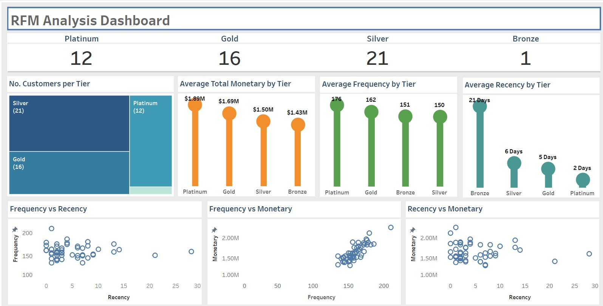

# Project 7: RFM (Recency, Frequency, Monetary) Analysis on US Regional Sales

## Author
Shokhina Badrieva
(shokhina.badrieva@gmail.com)

 

## Business Problem and Motivation
As a data analysis company, understanding customer behavior is essential to developing successful marketing campaigns. One approach we use is RFM analysis, which is a valuable tool for segmenting customers based on their transactional behavior.
 
 
RFM analysis considers three critical factors: recency, frequency, and monetary value. By analyzing these factors, we can divide customers into four different tiers: platinum, gold, silver, and bronze. Each of these tiers provides valuable insights into customer behavior, allowing us to tailor marketing strategies that are relevant and effective.
 
 
To conduct RFM analysis, we will use SQL, a powerful database language that can efficiently process large amounts of data. We will use SQL queries to extract the necessary information from our customer transaction data, including purchase date, frequency, and monetary value. Once we have this data, we can use Tableau to visualize and analyze it, creating intuitive dashboards and reports that will allow us to gain valuable insights into customer behavior.

 

## Data Source
The data source is an in an excel file from data.world and is titled US_Regional_Sales_Data.xlsx in this repository. [Link to dataset](https://data.world/dataman-udit/us-regional-sales-data)

 

## Methods/Skills Used
The project utilizes the following skills:
* Tableau custom charts
* SQL Joins, CTE's, Views, Ntiles
* RFM Analysis

 

## Tableau Results
The interactive tableau dashboard can be viewed [here.](https://public.tableau.com/app/profile/shokhina.badrieva/viz/RFM_Analysis_Dashboard/Dashboard1)

 

## Quick Glance at Results

